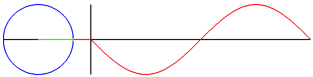

## 说明
这是一个水球形canvas进度条，代码不多：不必为了一个canvas效果而引入一个canvas插件库😢
## 预览
[demo]()
## 实现思路
1. 给canvas一个圆形容器，填充这个canvas，超出部分不显示（为了体现出来，这里给显示出来了）

```html
 <div class="canvas-container">
	<canvas id="MyCanvas" width="300" height="300"></canvas>
</div>
```
2. 多点成线：通过正选函数y=Asin(ωx+φ)+k 绘制一个sin曲线，连接容器的多个点，获得一个填充区域

``` js
content.moveTo(0, begin_y); //移到绘画开始点
content.fillStyle = color; //设置填充canvas填充的颜色
for (let x = 0; x < canvasWidth; x++) { //根据y=Asin(ωx+φ)+k画canvas sin曲线
	content.lineTo(x, A * Math.sin(w*x + k) + begin_y)
}
content.lineTo(canvasWidth, canvasHeight); //连接canvas右下角的点
content.lineTo(0, canvasHeight); //连接canvas左下角的点
content.closePath(); //连接开始点
content.fill(); //填充canvas
```

3. 设置一个定时器，让曲线在水平方向上偏移，使得其呈现出 波浪动画效果
``` js
var k1 = 300;
var k2 = 0;
clearInterval(handleTimer);//变量之前有设置
handleTimer = setInterval(function () {
	clearDraw();
	draw(-9, k1, 0.01, canvasHeight*percent, '#bbf3e6');
	k1 += .15;
	draw(10, k2, 0.02, canvasHeight * percent, '#69e0c4');
	k2 += .1;
	return
}, 100);
```
## 注意点：
百分比：y轴越小，百分比越大